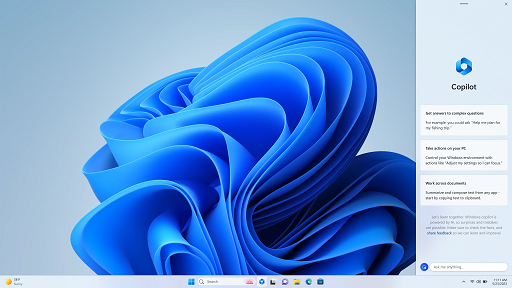

# DIO_NattyOrNot
Natural ou Fake Natty? Como Vencer na Era das IAs Generativas!

# Inspiração Biológica nas redes Neurais Artificiais.

## 📒 Descrição
Utilizei uma IA generativa para escrever um texto sobre como a inspiração biológica pode contribuir para as redes neurais artificiais.
A IA escolhida foi o Copilot do Windows 11 junto com a ferramenta MariTalk.

## 🤖 Tecnologias Utilizadas
Copilot do Windows 11 Pro



MariTalk


## 🧐 Processo de Criação
Utilizei o seguinte pronpt para gerar o texto

```
Como podemos utilizar a inspiração biológica no aprimoramento das redes neurais artificiais.

```
Este pronpt foi inserido no Copilot do Windows 11 e depois submeti o texto a IA MariTalk para revisão e aprimoramento.


## 🚀 Resultados
As redes neurais, inspiradas no funcionamento do cérebro humano, são uma ferramenta poderosa no campo do aprendizado de máquina. No entanto, elas não estão limitadas apenas ao nosso entendimento da biologia humana; podem aprender com outros sistemas naturais e até mesmo com animais. Vamos explorar como isso acontece:

1. **Inspiração Biológica**:
   - As redes neurais artificiais (RNAs) foram inicialmente concebidas com base na estrutura e funcionamento dos neurônios no cérebro humano. No entanto, essa inspiração biológica não se restringe apenas aos humanos. Podemos aprender com a organização e eficiência de sistemas biológicos em geral.
   - Lição: Assim como os neurônios se comunicam e formam conexões sinápticas, as RNAs também se baseiam em unidades interconectadas para processar informações e tomar decisões.

2. **Aprendizado a partir de Padrões Naturais**:
   - Observar padrões naturais pode inspirar algoritmos de aprendizado. Por exemplo, o voo das aves, a formação de cardumes de peixes e os padrões de crescimento de plantas podem ser estudados para otimizar algoritmos de busca, roteamento ou até mesmo reconhecimento de padrões.
   - Lição: Algoritmos de otimização, como os inspirados em enxames (como o algoritmo de otimização por partículas), podem aprender com esses comportamentos naturais.

3. **Redes Neurais Convolucionais e Visão Computacional**:
   - As redes neurais convolucionais (CNNs) são amplamente usadas em visão computacional. Elas foram inspiradas na organização das células do córtex visual do cérebro de mamíferos.
   - Lição: A estrutura das CNNs, com camadas de convolução e pooling, reflete como o cérebro processa informações visuais.

4. **Aprendizado Social e Imitação**:
   - Alguns animais aprendem observando outros membros de sua espécie. Isso também pode ser aplicado em algoritmos de aprendizado, como o aprendizado por imitação.
   - Lição: Algoritmos de aprendizado por imitação podem ser treinados para replicar comportamentos observados em sistemas naturais.

5. **Adaptação e Resiliência**:
   - Animais se adaptam a mudanças ambientais e evoluem para sobreviver. Algoritmos de aprendizado também precisam ser flexíveis e resilientes.
   - Lição: Técnicas como transferência de aprendizado permitem que modelos pré-treinados se adaptem a novos domínios.

Em resumo, as redes neurais podem aprender com a natureza, seja diretamente dos sistemas biológicos ou indiretamente, ao observar padrões e comportamentos. A ciência da computação e a biologia continuam a se influenciar mutuamente, e essa interação é fascinante! 🌿🧠✨

¹: [Redes neurais: o que são, para que servem e qual a importância](https://blog.kalatec.com.br/redes-neurais/)
²: [O que é uma rede neural? | IBM](https://www.ibm.com/br-pt/topics/neural-networks)
³: [Redes neurais: conceitos e aplicações | Aplus Plataforma](https://aplusplatform.com/redes-neurais/)
⁴: [Inteligência Artificial e Redes Neurais - Centro de Pesquisa em Ciência ...](https://www.ipea.gov.br/cts/pt/central-de-conteudo/artigos/artigos/106-inteligencia-artificial-e-redes-neurais)

Fonte: conversa com o Copilot, 09/08/2024
(1) Redes neurais: como funcionam, exemplos, tipos e muito mais!. https://blog.kalatec.com.br/redes-neurais/.
(2) O que é uma rede neural? | IBM. https://www.ibm.com/br-pt/topics/neural-networks.
(3) Redes neurais: conceitos e aplicações | Aplus Plataforma. https://aplusplatform.com/redes-neurais/.
(4) Inteligência Artificial e Redes Neurais - Centro de Pesquisa em Ciência .... https://www.ipea.gov.br/cts/pt/central-de-conteudo/artigos/artigos/106-inteligencia-artificial-e-redes-neurais.